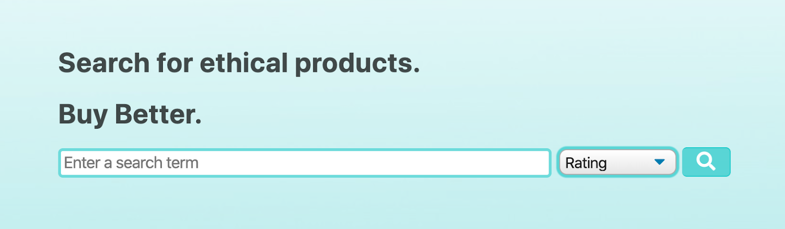
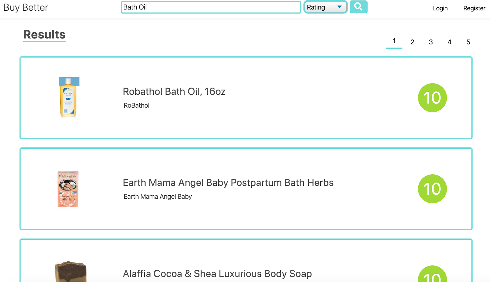
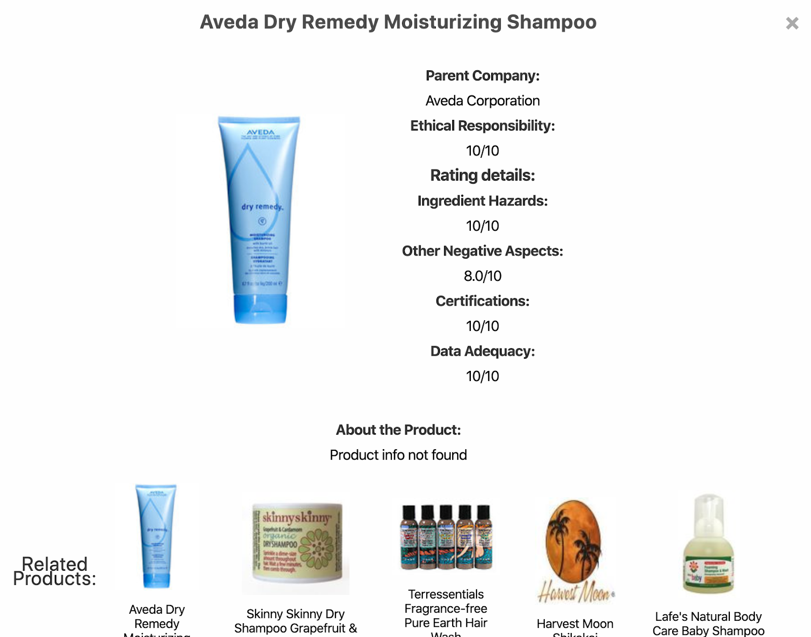
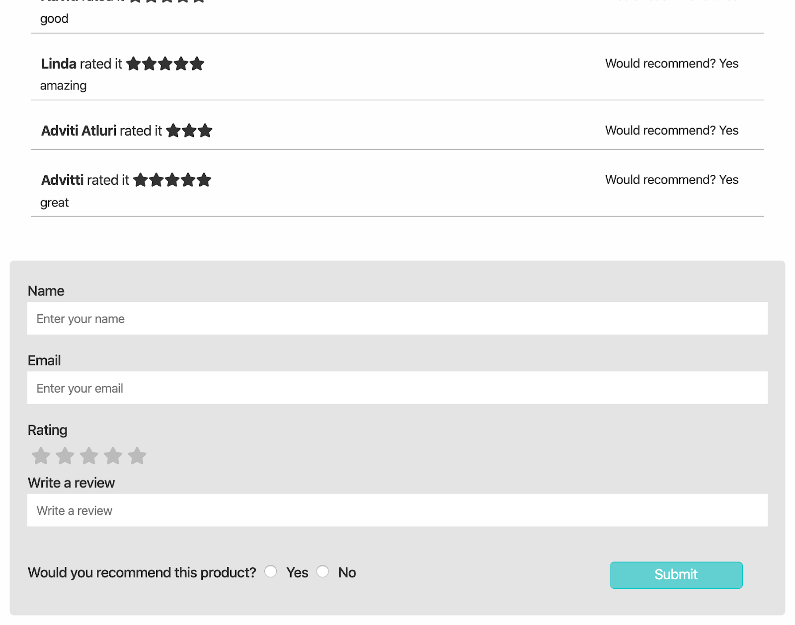
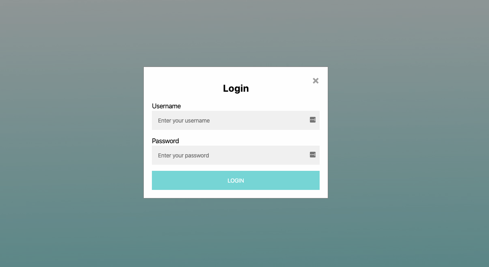
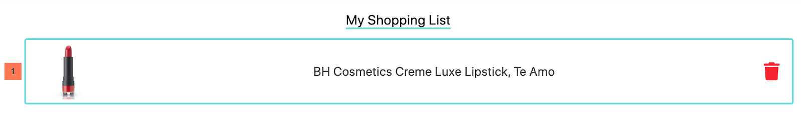

# Final Report (P8) 
Adviti Atluri, Jackson Schuster, Jenni Hutson, Andre Norton

## Problem & Related Work (P1)
The core of our problem is that there is a lack of transparency regarding company ethics and subsequent environmental impacts of their products. We believe this issue to be important as we tackle climate change and raise consumer consciousness. There are currently some existing solutions that have some information about company ethics, but they are clunky and hard to use, and do not offer a shopping list feature. Our information and ratings come from several environmental and rating groups, and we take that information and make it more easily navigable and digestible.

## User Research (P2 & P3)
The most crucial information we needed to gain from our user research revolved around how our users would use our app, and what those users found to be most important to them. We created a poll to get basic ideas about the problem and our assumptions from a wide range of potential users. This allowed us to quickly get an overview of numerous users without dedicating unnecessary resources to each person. We also did an interview with one person to get a deeper understanding of considerations made surrounding ethical shopping from someone who often goes to the store with this consideration in mind. Some questions we asked were if our interviewee currently considers ethics while shopping, and if he already has opinions formed about the ethics of the production methods of the companies from which he buys. Although we considered conducting a contextual inquiry of a potential user while shopping as they do now without our product, in the end we dismissed the idea due to fears that our presence would pressure the interviewee to act differently than they would normally, such as consciously buying more ethical products than they usually do. From our polling, we found that price is the most important factor in purchase decision, and company ethics is not a top priority. However, there are many people who say they don’t factor in company ethics because of a lack of available information. As for potential users, we believe they would be environmentally conscious people with a higher disposable income who can afford to change their shopping habits, and shop for groceries and household goods frequently. We would expect our users to be people who are relatively computer/smartphone literate and enjoy using their phones. There is no particular age range or background, or occupations in the target audience. It could also potentially be used by sellers to market their products to environmentalists by the product’s score on the app/database.

## Paper Prototyping (P4)
	https://www.youtube.com/watch?v=5hWiLfKZSmU&t=1s
We asked our users a series of questions focused around basic use and navigation of the app. We gave our users a recipe and asked them to search for each item and save said item to a shopping list where all of those products would be catalogued. None of our interviewees had issues with this task. Next, we physically handed them an item and asked them to search for more information about that product by scanning it. None of our users had issues with scanning our product, however once the item was scanned a few users had difficulty navigating our interface to find more information about the product. This was valuable feedback that we took into account for future tests. Finally we asked out users to search for a specific product that they had previously bought, and leave a review for that product. None of our users had difficulty with this task, but many provided suggestions that we used for future revisions. We took all of this feedback and applied it to our prototype, despite most of it being minor. We took this to mean we had a successful paper prototype.

## High-Fidelity Prototyping (P5, P6, & P7)
The first task scenario we implemented was for the user to search for a desired product. The user can filter their search by relevance or by ethical rating. We chose to implement an interactive data filter. We use the catalog of products from goodguide.com as our dataset. The user is able to filter by keywords in the search bar and then by relevance or rating. The results then appear on the page with relevant information based on the search.

### This is our homepage.

We originally opted for the homepage to be an empty shopping list that would be filled, but in user testing we learned that users would prefer it to open to the search page. We also center the search bar and have a blue gradient when the page is first opened to reduce the amount of white space. The search bar is moved to the top of the page once the user searches once.

### This is what our search results look like.

We include some basic information about the product as well as an overall rating out of ten, with a color to associate the number with being good, average, or poor

The second task scenario we implemented was for the user to find out more about a desired product and leave a review. Clicking on the product card in the search page opens a page which contains information about the product itself and the rating system used to score that product. On this page, the user is also able to read and write reviews that are saved on a backend server. We chose to implement a data collection form as our second component. The user sees previous reviews (fetched from the server), as well as a form to enter his/her own review of a product, inputting their name, review, rating, email, and whether they would recommend the product. Once the submit button is pressed, the data is packaged as a JSON and sent to a backend server.

### This is an example of our product cards.

### This is what our review section looks like.

The third and final task scenario we implemented was for the user to add their desired products to a shopping list in order to make in-store ethical shopping easier. After accessing a product card, users can click the “Add to shopping list” button and the item will be added to the homepage list. We chose to implement a user profile page. The user can log in to add and store items in his or her shopping list. The log in feature takes in a user’s password and username, when the “Login” button is clicked from the homepage. They are greeted and thier shopping list in loaded into the web app.

### Clicking the login button opens the login form shown below.

### This is an example of our shopping list.
 

## Reflection
We managed to create an app that lets users search for products they want to know more about, compare similar items, and see how each individual item is ranked, as well as seeing reviews other people have left about that specific product. We also give users the option to create an account to save their favorite items to a shopping list so that they can easily go back to their prefered items. Had we been given more time to work on our app, we most likely would have begun optimizing our mobile experience, added price data to our items, and increased our catalogue of products. 

## Links
- Github Repository: https://github.com/HCI330EthicalConsumption/EthCon

As of June 1st, 2020, our data source has been shut down. Unfortunatly, search capability has been lost for now.
- Github pages: https://hci330ethicalconsumption.github.io/EthCon/ 
- Instructions: The application is best viewed on Google Chrome desktop. To access the backend, you must use the github pages site, or host the website locally with the live server Visual Studio Code extension. Once you reach the website, you will be greeted by our home page. From there you are free to search for any product you want, keep in mind most of our database is centered around self care items. You can sort your results with the drop down menu next to the search bar. Once you’ve found an interesting item you can click on it to open the popup card, from there you can read about the item and see reviews other users have left, or leave one yourself. You can also make an account and save an item to your shopping list to save it for later viewing.

